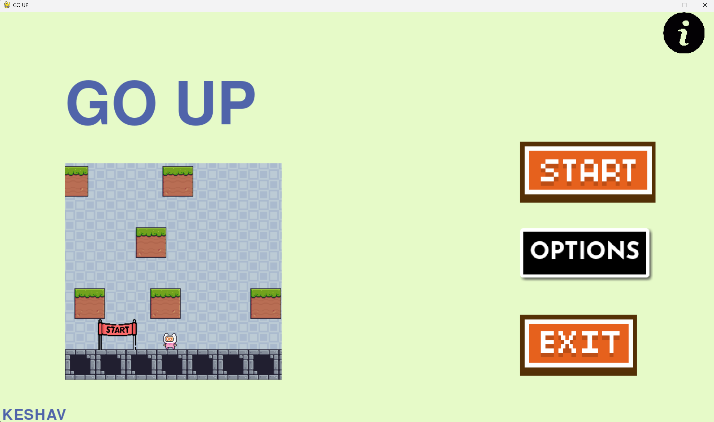
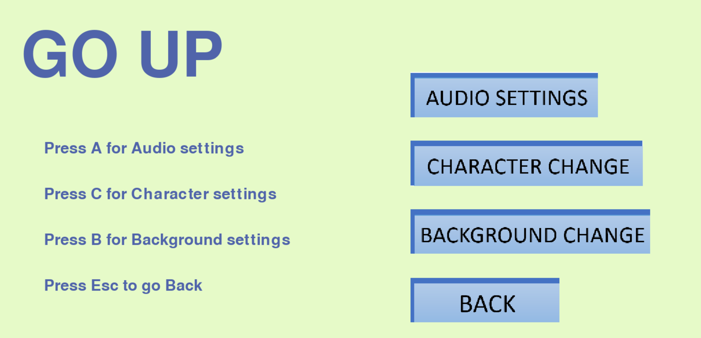

# 🎮 GO UP – 2D Platformer Game

**GO UP** is a Python-based 2D vertical platformer game made using **Pygame**. You control a cute ninja frog jumping on platforms, dodging traps, and reaching the top.

## 🧠 Features
- Double jump mechanics
- Fire traps with animation
- Score tracking based on height
- Victory and game-over screens
- Custom terrain and side walls

## 📸 Screenshots

### Start Screen


### Options menu


[🎥 Watch Demo (MP4)](demo/video.mp4)


## 🚀 How to Run

1. Install dependencies:
   ```bash
   pip install pygame
   ```
2. Run the game:
   ```bash
   python main.py
   ```

🙌 Creator
Built with ❤️ by Keshav Verma
🎓 Bennett University

---

## 🙏 Credits

- Some character sprites, background art, and code logic were inspired by or adapted from [TechWithTim‬]  
- GitHub: [https://github.com/Python-Platformer](https://github.com/techwithtim/Python-Platformer.git)  
- License or Attribution: Used under Creative Commons / MIT / Open Asset license (whichever applies)

> If you're the original creator and want the content removed or credited differently, feel free to reach out.

## 📜 License

This project is licensed under the MIT License.  
Assets credited above are used under fair usage or open-source guidelines.
