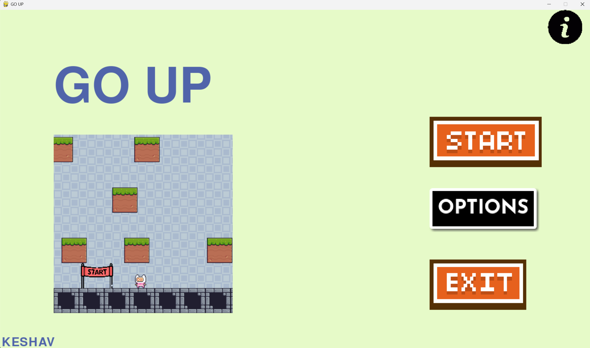
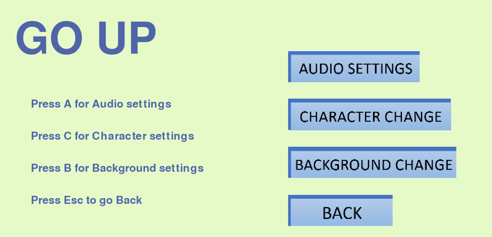

# 🎮 GO UP – 2D Vertical Platformer Game

<p align="left">
A fast-paced 2D platformer built with <b>Python</b> and <b>Pygame</b> where players jump across platforms, dodge traps, and climb to the highest point.
</p>

<p align="center">


</p>

---

# 🎥 Gameplay Preview

<p align="center">

</p>

🎯 **Goal:** Reach the highest point in the level while avoiding traps and falling platforms.

📥 **Download Full Gameplay Video**

[Download Gameplay Video](demo/video.mp4)

---

# 📌 Overview

**GO UP** is a vertical 2D platformer game developed using **Python and the Pygame library**.

Players control a ninja frog character that must **jump across randomly positioned platforms**, avoid **animated fire traps**, and reach the **highest point in the game world**.

The project demonstrates core **game development concepts** such as:

* sprite animation
* collision detection
* gravity physics
* procedural platform generation
* menu systems and game states

The project was developed to explore **2D game development, physics simulation, and interactive gameplay systems using Pygame**.

---

# 🛠 Technologies Used

* **Python**
* **Pygame**
* **Sprite Sheet Animation**
* **Object-Oriented Game Architecture**

---

# 📸 Screenshots

### 🏠 Main Menu

<p align="center">

</p>

The main menu allows players to:

* Start the game
* Open settings
* Exit the application

---

### ⚙️ Options Menu

<p align="center">

</p>

Players can customize:

* Character selection
* Background color
* Audio settings

---

# 🚀 Game Features

## 🕹 Core Gameplay

* Vertical platform climbing
* Gravity-based movement system
* Double jump mechanics
* Increasing difficulty as the player climbs

---

## 🔥 Obstacles

* Animated fire traps
* Collision detection with hazards
* Player damage and game-over logic

---

## 🎨 Customization

Players can customize:

* Character skins
* Background themes
* Audio settings

---

## 🏆 Game States

The game includes multiple states:

* Start screen
* Options menu
* Gameplay
* Game Over screen
* Victory screen

---

# 🎮 Controls

| Key          | Action      |
| ------------ | ----------- |
| ← / A        | Move Left   |
| → / D        | Move Right  |
| Space / W    | Jump        |
| Double Space | Double Jump |
| ESC          | Exit / Back |

---

# 🧠 Game Mechanics

The game implements several important programming concepts.

## Physics System

* Gravity-based movement
* Jump velocity and falling acceleration

## Collision Detection

The game uses **pygame masks** to detect collisions between:

* player and platforms
* player and traps

## Procedural Platform Generation

Platforms are generated using **randomized X positions while maintaining consistent vertical spacing**, creating a dynamic climbing experience.

## Sprite Animation

Character movement animations include:

* idle
* running
* jumping
* double jumping
* falling
* hit reaction

---

# 📂 Project Structure

```
go-up/
│
├── assets/             # Game assets
│   ├── Background/
│   ├── Terrain/
│   └── images/
│
├── demo/               # Demo media
│   ├── game.png
│   ├── menu.png
│   ├── options.png
│   └── video.mp4
│
├── main.py             # Main game loop
└── README.md
```

---

# ⚙️ Requirements

Install dependencies:

```bash
pip install pygame
```

---

# ▶️ Running the Game

Clone the repository:

```bash
git clone https://github.com/KESHAV-26-2004/go-up.git
```

Run the game:

```bash
python main.py
```

The game window will launch and display the main menu.

---

# 💡 Technical Highlights

This project demonstrates:

* Object-oriented game architecture
* Sprite sheet animation loading
* Dynamic terrain generation
* Event-based input handling
* Game state transitions
* Audio integration

---

# 👨‍💻 Author

**Keshav Verma**
B.Tech CSE – Bennett University
Game Developer | Software Developer

🔗 LinkedIn
[https://www.linkedin.com/in/keshav262004](https://www.linkedin.com/in/keshav262004)

---

# 🙏 Credits

Some assets and development ideas were inspired by:

**Tech With Tim – Python Platformer**

GitHub Repository:
[https://github.com/techwithtim/Python-Platformer](https://github.com/techwithtim/Python-Platformer)

Assets used under open-source or educational licenses.

---

# ⭐ Support

If you like this project, consider giving it a **star ⭐ on GitHub**.

---